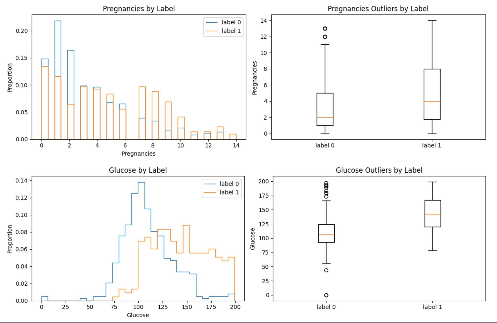
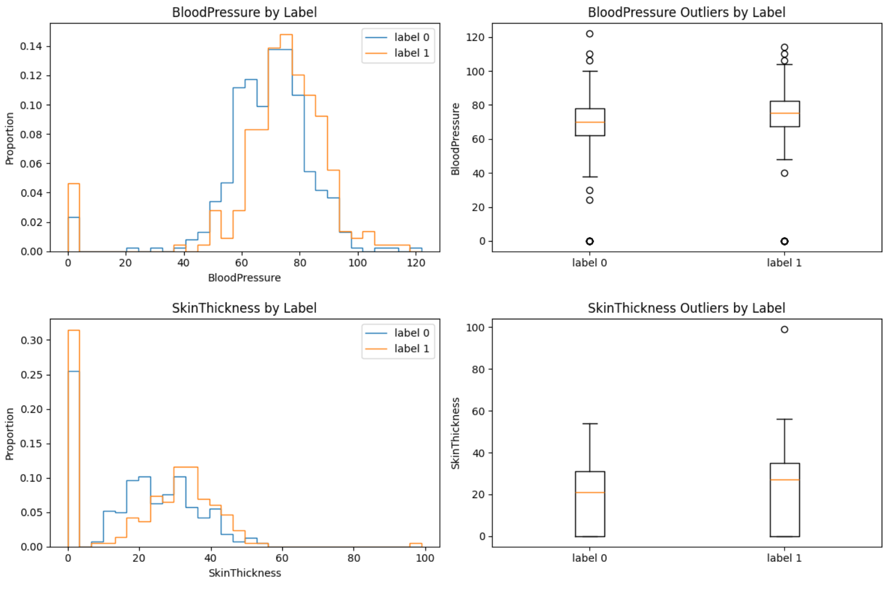
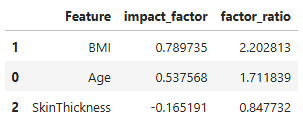
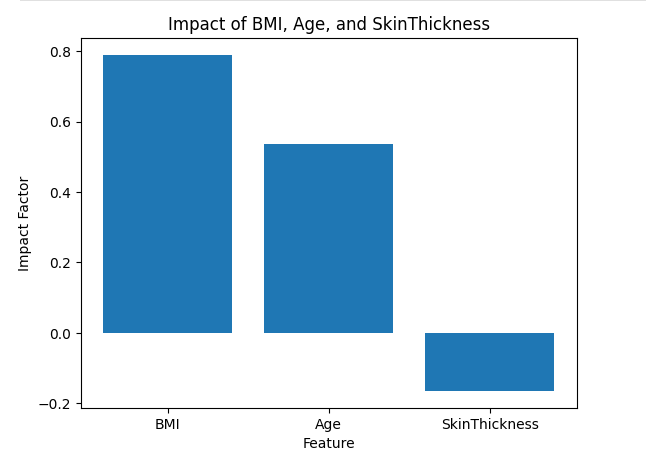
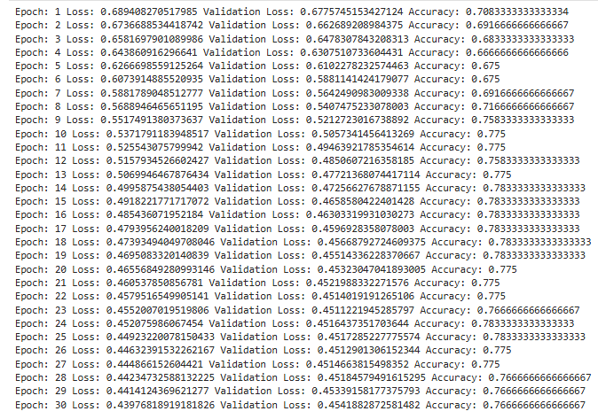
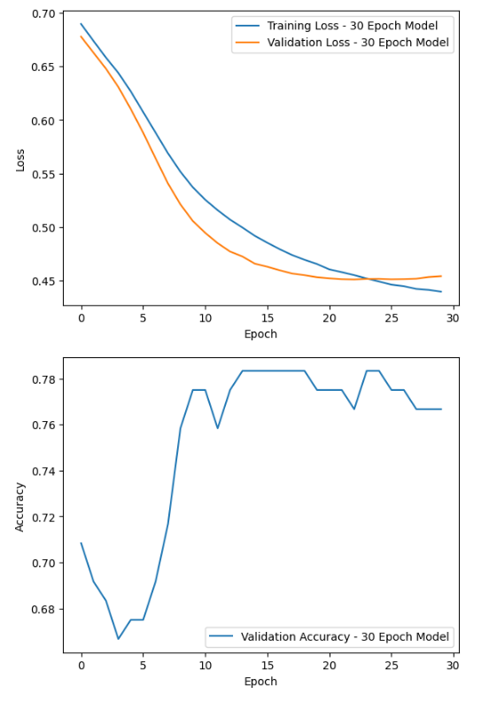
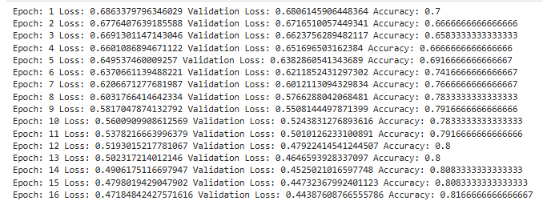
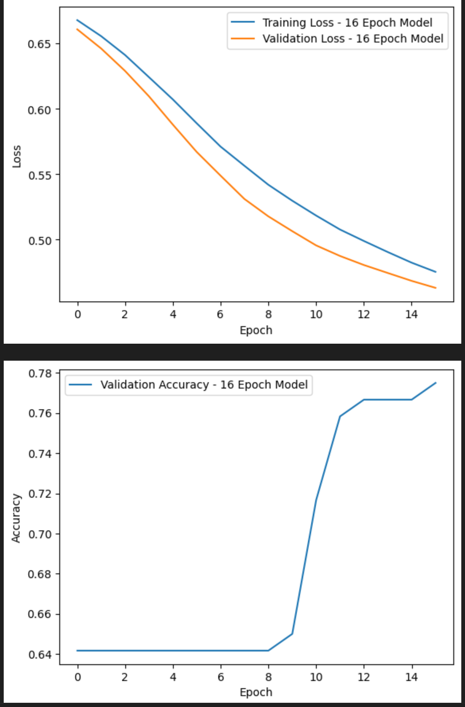

# Diabetes Prediction with Neural Network Kaggle Challenge

* This repository attempts to train a feedforward NN for predicting whether a person with the given symptoms has diabetes or not using data from the "Diabetes Prediction" Kaggle challenge
* [https://www.kaggle.com/competitions/diabetes-prediction-with-nn/overview](https://www.kaggle.com/competitions/diabetes-prediction-with-nn/overview). 

## Overview

### **Definition of the tasks / challenge:**
 * The task here is a binary classification problem where I have to use structured tabular data to predict whether a person has diabetes or not. (0 = no, 1 = yes) The dataset contains one ID column, 8 numerical health-related features, and one target label - for a total of 10 columns; the goal here is to learn patterns that seperate the two classes.
### **My approach:**
 * My approach to this task is to treat this as a standard supervised learning problem by exploring & cleaning the data, then scaling the features up, testing the different models like Logistic Regression and a Neural Network built with PyTorch. I then also compare how the models perform to see which one is able to handle the data better.
### **Summary of the performance achieved:** 
 * From what I could see the Logistic Regression model performed pretty well, however the neural network gave me significantly more flexibility to experiment and improve the performance of the model. Overall the results I achieved are very solid for a starting model; but I believe there is still room to improve with tuning / data preparation.

## Summary of Work Done:

 ### Type of Data:
   * The data is stored in CSV files. The input data contains tabular health-related features, and the output is a binary diabetes label.

     * Input: The input features are "Pregnancies", "Glucose", "BloodPressure", "SkinThickness", "Insulin", "BMI", "DiabetesPedigreeFunction", and "Age".
     * Output: The output is the "label" column, where "0" means the person does not have diabetes and "1" means the person does have diabetes.

 ### Size of Data:
   * Training data: The training dataset has 600 rows and 10 columns. (train.csv)
   * Test data: The test dataset has 168 rows and 9 columns. (test.csv)

### Instances (Train, Test, Validation Split): 
   * There are 600 labeled training instances and 168 unlabeled test instances. I used the training data to create my own train/test split for model evaluation with train_test_split.

## Preprocessing / Clean up

### Here I went through the dataset step by step to make sure everything is usable:
  * First I check for any missing values using .isnull().sum()
  * Then I look at the data types to make sure everything is as it should be & that my data is the correct data set.
  * I check the class balance using value_counts() on the target column
  * Afterwards I define outliers using the IQR method - But I don't remove them, I just visualize them.
  * And finally I scale the features using StandardScaler; so everything is on the same range.

## Data Visualization

### Here I visualize the data to better understand what's going on with the data:
  * I compare the distributions of features between class 0 and class 1.
  * Then I use boxplots next to each feature to show how values differ & where outliers are.
  * That helps me see which features might actually be useful to me to predict between class 0 and class 1.

### From this I can already tell some features separate the classes better than the others.

### I also added a small "RiskFeature" visualization to test a few features to see which had the strongest impact within the data:
  * From this graph, I can see that BMI had the highest impact factor. (This means that it had the strongest relationship / strongest evidence of the three within the model to predict whether or not someone has diabetes.)
  * Age was also important here! But it was not as strong as BMI.
  * SkinThickness also had a impact here; But it was a negative impact. (This means that, Within this model - Higher SkinThickness was associated more with the non-diabetes class compared to other features!)

### You can see this from both the Table as well as the Plot on how these features impact the data.

## Problem Formulation

### Input / Output
* Input: The input to the model is a vector of 8 numerical features:
  * "Pregnancies", "Glucose", "BloodPressure", "SkinThickness", "Insulin", "BMI", "DiabetesPedigreeFunction", and "Age".
* Output: The output is a single binary value (0 or 1), where:
  * 0 = The person Does Not Have Diabetes
  * 1 = The person Has Diabetes

## The different models I tried & Why:

### **Logistic Regression**
  * I tried Logistic Regression first since it is a good baseline model for binary classification & I attempted to do this in the labs.
  * Since the output is only 0 or 1, this model can help me see how well a simple model can seperate the two classes from each other.
### **Feedforward Neural Network**
  * I also tried a feedforward neural network because the challenge called for it & I wanted to see if a more flexible model could perform better than Logistic Regression.
  * The neural network takes the same 8 input features and passes them through hidden layers before making the final prediction.

## Loss, Optimizer and Hyperparameters:

### **Loss Function:** Binary Cross Entropy Loss
  * I used this because the task is binary classification.
### **Optimizer:** Adam
  * I used Adam because it adjusts the learning rate during training and usually works well for neural networks.
### **Other Hyperparameters:**
  * Number of input features: 8
  * Number of output values: 1
  * Epochs: At first 200, then 30, then 16.
  * Batch Size: Set using DataLoader.
  * Learning Rate: Set before training, and can be tuned later on.

## Training

### Here is how I trained the models:
  * I used PyTorch to build and train the neural network.
  * The data from Pandas and NumPy was converted into tensors and loaded using DataLoader for batching.
  * The model was then trained over multiple epochs repeatedly while tracking the loss as I honed in on it overfitting, till I was satisfied with the model.

### Training time
  * The training did not take very long since the dataset is relatively small and everything was run locally.

### Training Curves
  * I tracked the Validation Loss and the Training Loss & Accuracy over each epoch once I found that it was most likely under 30 epochs before overfitting.
  * The loss decreased over time, which showed the model was improving.

### How I decided to stop training
  * I stopped training after I found the sweet spot of 16 epochs
  * The reason for stopping is because my Validation Loss was not going down anymore, and my Accuracy was not going up any, either.

### Difficulties Training
  * The only difficulties I experienced was scaling the features, and making sure the bins were all together and lined up properly.
  * As well as avoiding overfitting with the neural network.

## Performance Comparison

### Metrics used:
  * Accuracy was used to measure how often the model predicted the correct class.
  * Training loss was used to see how well the model was learning on the training data.
  * Finally, Validation loss was used to check how well the model performed on unseen data during training.

### Here are a few visualizations of the data to show how these metrics were used.

## Conclusions

  * Simple models like Logistic Regression works very well for this problem.
  * Neural Networks however, provide much more flexibility; though they need tuning to perform better.
  * Since the dataset is not very large or complex, larger models are not necessary.

## Future Work

### If I were to continue this project:
  * I would potentially tune the hyperparameters (The learning rate, number of layers, etc...)
  * Maybe try a different model to see how it performs to compare against Logistic Regression and the Neural Network
  * Improve the data preparation and feature usage by looking more closely at outliers, my scaling and which features are most useful for prediction to potentially get a better accuracy.
  * Maybe use cross-validation instead of a single split because it might give a better idea of how well the model performs across different parts of the dataset.

## How to reproduce results

* Follow these steps in order.

1. Download the dataset from Kaggle or this Repository.
2. Make sure all of the files ("train.csv", "test.csv", and "sample_submission.csv") are all in the same folder as "DiabetesPrediction.ipynb".
3. Install the required packages:
   * pip install pandas numpy matplotlib scikit-learn torch
4. Open the notebook "DiabetesPrediction.ipynb"
5. Run all cells in order.

### After running all cells:
  * The notebook will load, and preprocess the data
  * Train the models (Logistic Regression and Neural Network)
  * Output the evaluation results (Accuracy, Validation Loss, Training Loss)

## Resources:
  * The project can be run locally using your CPU.
  * It can also be run using Google Colab if you prefer that. You would just have to change the notebook around a bit.
  * A GPU or TPU is not required since the dataset is relatively small.
  
## Overview of files in repository
  * DiabetesPrediction.ipynb:
     * This is the main file for the entire project.
     * It includes everything from loading the data, cleaning and preprocessing, visualizing the features, training the models, and evaluating performance.
  * train.csv:
     * This is the training dataset provided by Kaggle.
     * It contains the input features along with the label column used to train the models.
  * test.csv:
     * This is the test dataset provided by Kaggle.
     * It contains the same input features but does not include the label, so it is used for making predictions.
  * sample_submission.csv:
     * This is the example format provided by Kaggle.
     * It shows how the final predictions should be structured for submission.
  * submission.csv:
     * This is the output file generated by the model.
     * It contains the predictions made on the test dataset in the correct format for Kaggle submission.
  * 30-Epoch.png:
     * This shows the training and validation loss over 30 epochs.
     * It helps to visualize how the model is learning over time and whether it is overfitting.
  * 30-Histogram.png:
     * This shows the feature distributions and comparisons between the two classes for the 30 epoch run.
  * 16-Epoch.png:
     * This shows the training and validation loss over 16 epochs.
     * It is used to help compare against the 30 epoch model.
  * 16-Histogram.png:
     * This shows the feature distributions and comparisons between the two classes for the 16 epoch run.
  * Histogram-1.png:
     * This shows distributions of features like pregnancies and glucose separated by label and their relative boxplots.
     * It helps to further understand how the data is structured.
  * Histogram-2.png:
     * This shows additional feature distributions such as blood pressure and skin thickness separated by label and their relative boxplots.
     * It helps to further understand how the data is structured.
  * RiskFeatures-Table.png
     * This shows the Impact Factor and Factor Ratio for BMI, Age, and SkinThickness.
     * It helps to show which risk features had the strongest impact within the model.
  * RiskFeatures-Plot.png
     * This shows a bar graph comparing the Impact Factors of BMI, Age, and SkinThickness.
     * It helps to visualize that BMI had the highest impact, Age with the second highest impact, and SkinThickness having a negative impact.

## Software Setup

### Required Packages:
  * PyTorch
  * Pandas
  * NumPy
  * Matplotlib
  * Scikit-learn

### Installation:
  * **Run this in your environment:**
   * pip install torch pandas numpy matplotlib scikit-learn

## Data

  * The dataset can be downloaded directly from here or the Kaggle competition page:
   * https://www.kaggle.com/competitions/diabetes-prediction-with-nn/data?select=train.csv

  * Once the dataset is downloaded, place the files ("train.csv", "test.csv", and "sample_submission.csv") in the same directory as the notebook.

## Training

  * To train the model, run all of the cells in "DiabetesPrediction.ipynb"

  ### **The Notebook will:**
   * Load and preprocess the dataset.
   * Split the data into training and validation sets.
   * Train both the Logistic Regression model and the Neural Network.
   * Track Training Loss, Validation Loss, and Accuracy over each epoch.

   * The neural network is trained using PyTorch with a fixed number of Epochs (That can be changed - I used 16 for the final model.)

   * If you want to experiment here with it:
    * You could change the number of epochs, Adjust the learning rate, or modify the number of layers in the network.

## Performance Evaluation

### **The main metrics used are:**
   * Accuracy (How often the model predicts correctly)
   * Training Loss (How well the model fits the training data.)
   * Validation Loss (How well the model is doing based on the data it has not seen during training.)

### **These metrics are:**
   * Printed after each epoch during training.
   * Visualized using plots next to each other.

   * You can compare different runs (200 Epochs, 30 Epochs or 16 Epochs) using the saved graphs to see how the model behaves and where overfitting begins.

## Citations

* Kaggle Diabetes Prediction Challenge:
   *  [https://www.kaggle.com/competitions/diabetes-prediction-with-nn/overview](https://www.kaggle.com/competitions/diabetes-prediction-with-nn/overview)
* PyTorch Documentation:
   * [https://docs.pytorch.org/docs/2.11/index.html](https://docs.pytorch.org/docs/2.11/index.html)
* Scikit-learn Documentation:
   * [https://scikit-learn.org/stable/index.html](https://scikit-learn.org/stable/index.html)
* Pandas Documentation:
   * [https://pandas.pydata.org/docs/](https://pandas.pydata.org/docs/)
* NumPy Documentation:
   * [https://numpy.org/doc/](https://numpy.org/doc/)
* Why Does Obesity Cause Diabetes - PMC:
   * [https://pmc.ncbi.nlm.nih.gov/articles/PMC8740746/ ](https://pmc.ncbi.nlm.nih.gov/articles/PMC8740746/)
* Diabetes in the elderly - PMC:
   * [https://pmc.ncbi.nlm.nih.gov/articles/PMC5509969/](https://pmc.ncbi.nlm.nih.gov/articles/PMC5509969/)
* Evaluation of Morphological and Structural Skin Alterations on Diabetic Subjects by Biophysical and Imaging Techniques - PMC:
   * [https://pmc.ncbi.nlm.nih.gov/articles/PMC9962953/](https://pmc.ncbi.nlm.nih.gov/articles/PMC9962953/)
* Used an LLM to help guide me with some parts of the project.
   * [https://chatgpt.com/](https://chatgpt.com/)
